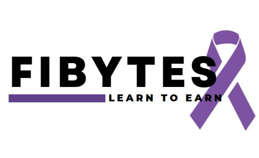

# Athena-shebytes 

# Fibytes - Financial Inclusion for Athena Hackathon October 2022

### ABOUT US

FiBytes is a platform to educate and connect domestic violence survivors with the financial resources necessary to live a more fulfilled life. Financial abuse is a precursor to physical and emotional abuse that prevents survivors from leaving their dangerous households. Through bite size bits of information, we equip survivors with the confidence and financial skills to become independent, to protect their family and to gain long term wealth.

### TECHNOLOGY USED

- HTML5
- CSS3
- JAVASCRIPT

### SCREENSHOTS

### TEAM

- Melanie
- Caitlin
- Rachel 
- Selaelo
- Jasum
